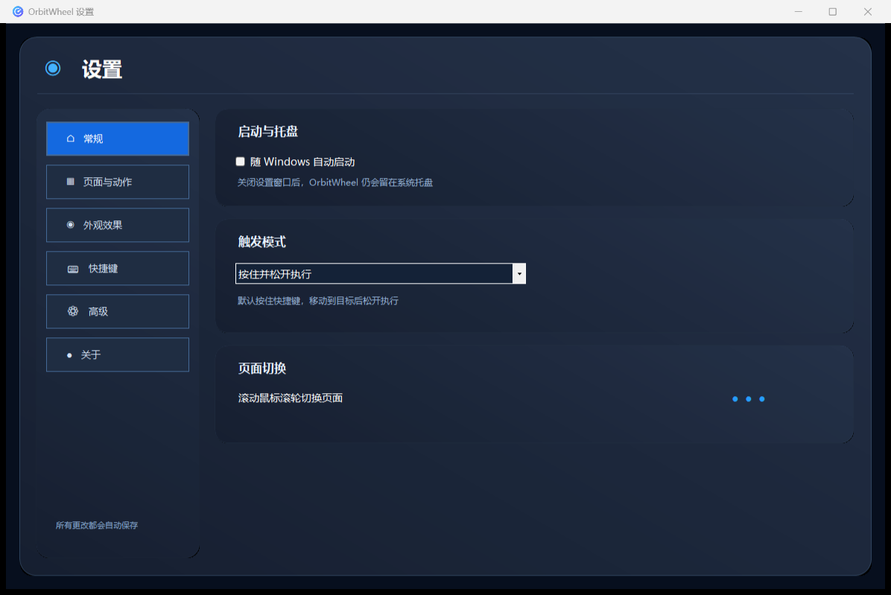

# OrbitWheel

OrbitWheel 是一款 Windows 径向快捷操作工具。按下自定义快捷键后，鼠标位置会出现六等分圆环，将鼠标移向目标扇区即可快速执行操作。

## OrbitWheel 1.1.2

OrbitWheel 1.1.2 延续全新设计的深色玻璃 UI、整套系统操作图标和通用托盘双击唤醒机制，并加入文件夹目标与圆环边缘自适应：



- 全新设置界面：左侧导航、玻璃卡片和分区设置页面
- 全新纯图标径向菜单，环内不显示动作名称
- 重新设计睡眠、音量、锁定、关机、重启等系统操作图标
- Applications 应用选择器，可识别 Store/UWP 和桌面应用图标
- 支持直接浏览普通程序文件
- 支持把文件夹设为动作目标，并直接用资源管理器打开对应文件夹
- 打开软件前检测运行状态，桌面程序与 Store/UWP 应用已运行时切换至现有窗口
- 已运行但关闭到托盘的软件会通过 Windows 托盘项模拟双击唤醒，同时兼容要求单击或双击恢复的应用
- 托盘双击唤醒期间持续锁定鼠标，检测到目标软件正常窗口出现后才解除；异常情况下最多等待 8 秒
- Store/AppsFolder 应用会解析真实进程名；存在正常可见页面时直接切换，仅关闭到托盘时模拟双击
- 快捷键支持直接录制任意组合键
- 默认使用“按住并松开执行”模式
- 扇区从右上开始顺时针编号 `1–6`，按对应数字键可直接执行
- 鼠标滚轮或左右方向键切换页面，支持无限页面
- 鼠标靠近屏幕边缘时会自动把圆环和鼠标移到可完整显示的位置
- 设置修改后自动保存
- 支持随 Windows 启动并常驻系统托盘

### 全新系统图标设计


## 使用

1. 下载对应版本的 `OrbitWheel-1.1.2.zip`。
2. 解压后运行 `OrbitWheel.exe`。
3. 双击托盘图标打开设置。

配置保存在 `%APPDATA%\OrbitWheel\config.json`。

## 构建

系统要求：Windows PowerShell 5.1 和 .NET Framework 4.x。

```powershell
.\build.ps1
```

构建结果位于 `dist\OrbitWheel.exe`。

## 许可证

[MIT License](LICENSE)
